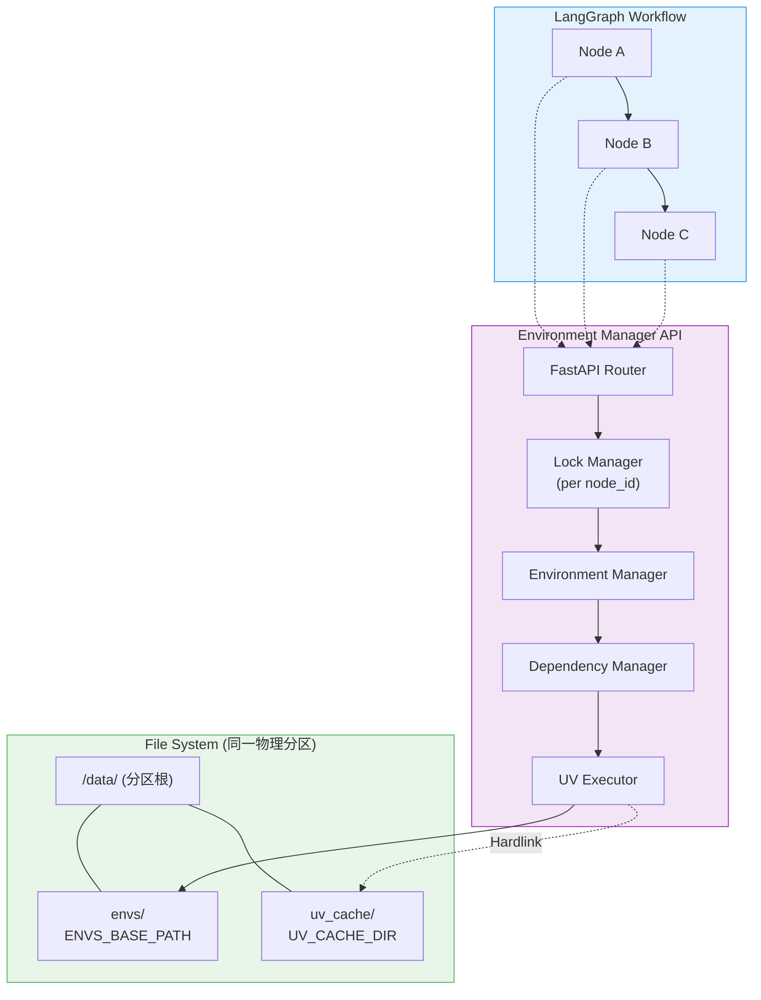
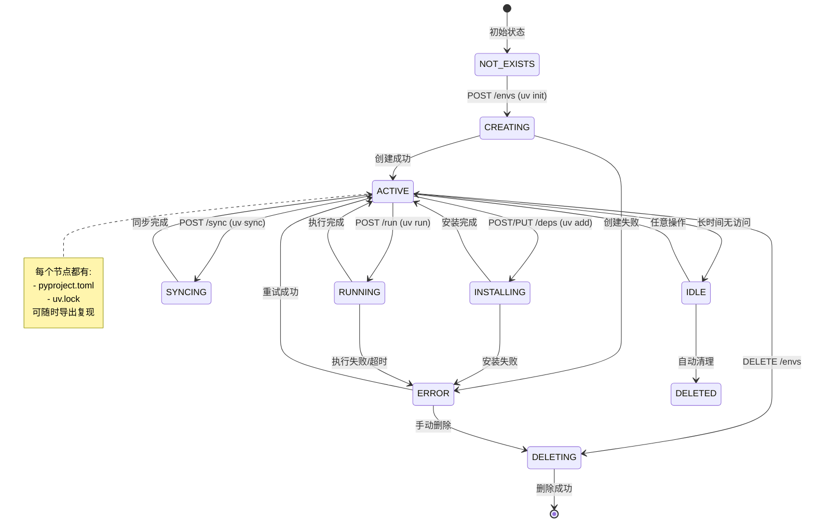
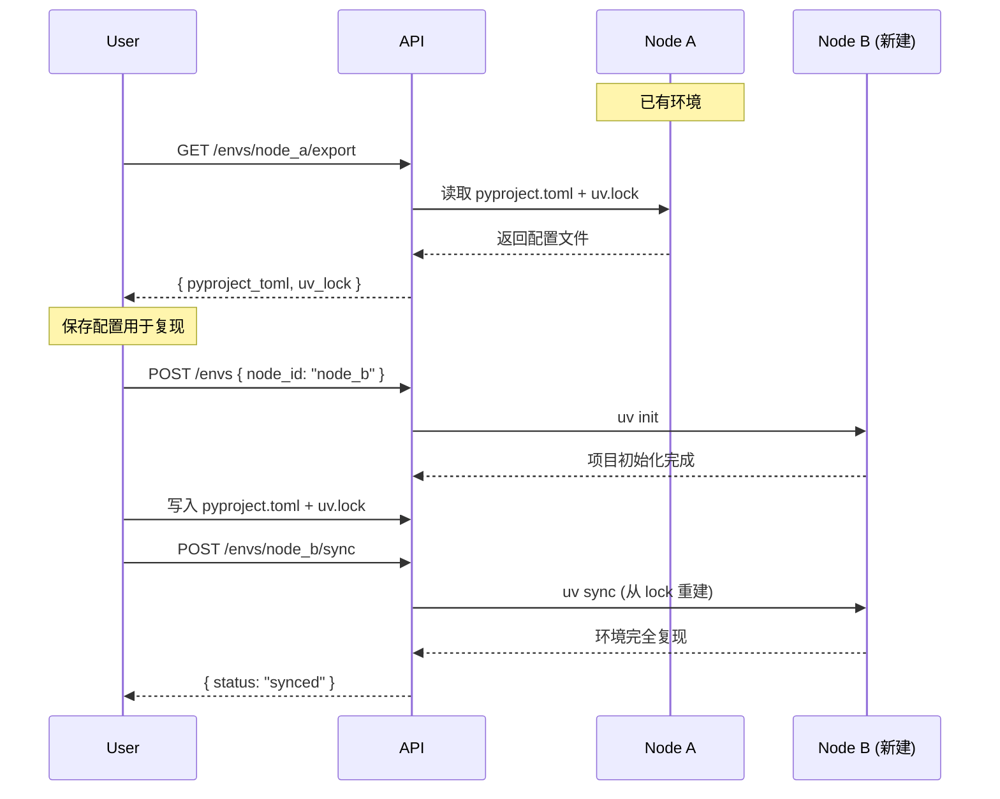

# LangGraph 节点虚拟环境管理系统

> 基于 UV 的节点级 Python 虚拟环境隔离与依赖管理服务

---

# 第一部分：产品需求文档 (PRD)

## 1. 产品概述

### 1.1 背景与问题

LangGraph 工作流中的每个节点可能需要执行不同的 Python 代码，这些代码依赖的第三方库版本可能存在冲突：

| 场景 | 问题示例 |
|------|----------|
| Node A | 需要 `numpy==1.24.0` |
| Node B | 需要 `numpy==2.0.0` |
| 冲突 | 共享环境下无法同时满足 |

### 1.2 产品目标

构建一个**节点级虚拟环境管理服务**，为每个 LangGraph 节点提供：

1. **独立的 Python 虚拟环境**
2. **依赖包的完整 CRUD 操作**
3. **通过 `pyproject.toml` + `uv.lock` 实现环境复现**
4. **环境生命周期管理**

### 1.3 范围声明

> [!CAUTION]
> **本系统仅解决依赖冲突问题，不提供安全沙箱功能**
> 
> - ✅ 解决：不同节点间的依赖版本冲突
> - ✅ 解决：环境可复现性（通过 lock 文件）
> - ❌ 不解决：恶意代码执行、资源限制、系统调用隔离
> 
> 如需安全沙箱，请使用 Docker、gVisor 或 Firecracker 等容器技术。

### 1.4 功能范围

| 功能 | 优先级 | 描述 |
|------|--------|------|
| 创建环境 | P0 | 为节点创建独立 UV 项目 |
| 安装依赖 | P0 | 使用 `uv add` 添加依赖 |
| 添加依赖 | P0 | 动态添加单个/多个包 |
| 删除依赖 | P0 | 使用 `uv remove` 移除包 |
| 更新依赖 | P0 | 升级/降级包版本 |
| 查询依赖 | P0 | 从 `pyproject.toml` 读取依赖列表 |
| 删除环境 | P0 | 清理节点环境 |
| **导出环境** | P0 | 导出 `pyproject.toml` + `uv.lock` |
| **复现环境** | P0 | 从 lock 文件重建环境 |
| 环境状态 | P1 | 查询环境健康状态 |
| 执行代码 | P1 | 在环境中运行 Python 代码 |
| 自动清理 | P1 | 清理长期未使用的环境 |

---

# 第二部分：架构需求文档 (ARD)

## 2. 系统架构

### 2.1 架构概览

```
┌─────────────────────────────────────────────────────────────────────┐
│                         LangGraph Workflow                          │
│    ┌────────┐     ┌────────┐     ┌────────┐     ┌────────┐         │
│    │ Node A │ ──▶ │ Node B │ ──▶ │ Node C │ ──▶ │ Node D │         │
│    └───┬────┘     └───┬────┘     └───┬────┘     └───┬────┘         │
└────────┼──────────────┼──────────────┼──────────────┼───────────────┘
         │              │              │              │
         ▼              ▼              ▼              ▼
┌─────────────────────────────────────────────────────────────────────┐
│                    Environment Manager API Layer                     │
│  ┌────────────────────────────────────────────────────────────────┐ │
│  │                      FastAPI Application                        │ │
│  │  POST /envs                       - 创建环境 (uv init)                   │ │
│  │  GET  /envs/{workflow_id}/{node_id} - 查询环境状态                          │ │
│  │  DELETE /envs/{workflow_id}/{node_id} - 删除环境                            │ │
│  │  POST /envs/{workflow_id}/{node_id}/deps - 添加依赖 (uv add)               │ │
│  │  GET  /envs/{workflow_id}/{node_id}/deps - 列出依赖 (读取 pyproject.toml)  │ │
│  │  PUT  /envs/{workflow_id}/{node_id}/deps - 更新依赖 (uv add --upgrade)     │ │
│  │  DELETE /envs/{workflow_id}/{node_id}/deps - 删除依赖 (uv remove)          │ │
│  │  POST /envs/{workflow_id}/{node_id}/sync - 同步环境 (uv sync)              │ │
│  │  GET  /envs/{workflow_id}/{node_id}/export - 导出 lock 文件                │ │
│  │  POST /envs/{workflow_id}/{node_id}/run - 执行代码 (uv run)                │ │
│  │  POST /envs/cleanup               - 清理过期环境                          │ │
│  └────────────────────────────────────────────────────────────────┘ │
└─────────────────────────────────────────────────────────────────────┘
                                  │
                                  ▼
┌─────────────────────────────────────────────────────────────────────┐
│                     File System Layer (同一物理分区)                 │
│  ┌────────────────────────────────────────────────────────────────┐ │
│  │  /data/                       <- 挂载的磁盘卷/物理分区根目录      │ │
│  │    │                                                            │ │
│  │    ├── envs/                  <- ENVS_BASE_PATH                 │ │
│  │    │   ├── node_a/            <- 独立 UV 项目                    │ │
│  │    │   │   ├── .venv/         <- 虚拟环境                        │ │
│  │    │   │   ├── pyproject.toml <- 项目配置 + 依赖声明             │ │
│  │    │   │   ├── uv.lock        <- 精确版本锁定                    │ │
│  │    │   │   └── metadata.json  <- 环境元数据                      │ │
│  │    │   ├── node_b/                                              │ │
│  │    │   │   ├── .venv/                                           │ │
│  │    │   │   ├── pyproject.toml                                   │ │
│  │    │   │   ├── uv.lock                                          │ │
│  │    │   │   └── metadata.json                                    │ │
│  │    │   └── ...                                                  │ │
│  │    │                                                            │ │
│  │    └── uv_cache/              <- UV_CACHE_DIR (平级目录!)        │ │
│  │        ├── wheels/            <- 下载的 whl 包                   │ │
│  │        ├── archives/          <- 源码包                          │ │
│  │        └── ...                <- Hardlink 共享包文件             │ │
│  └────────────────────────────────────────────────────────────────┘ │
└─────────────────────────────────────────────────────────────────────┘
```



### 2.2 环境生命周期状态机



### 2.3 核心组件

| 组件 | 职责 |
|------|------|
| **LockManager** | 并发控制：每个 node_id 对应一把 asyncio.Lock |
| **EnvManager** | 环境生命周期管理（创建/删除/查询/清理） |
| **DependencyManager** | 依赖 CRUD 操作（uv add/remove/sync） |
| **UVCommandExecutor** | UV CLI 命令封装与执行（跨平台路径处理） |
| **ProjectInfo** | 主项目依赖版本映射（确保子环境兼容性） |

### 2.4 UV 命令映射（使用 uv add 而非 uv pip install）

| 操作 | UV CLI 命令 | 说明 |
|------|-------------|------|
| **初始化项目** | `uv init {env_path}` | 创建 pyproject.toml |
| **添加依赖** | `uv add {packages} --project {env_path}` | 更新 pyproject.toml + uv.lock |
| **删除依赖** | `uv remove {package} --project {env_path}` | 从项目移除依赖 |
| **同步环境** | `uv sync --project {env_path}` | 从 uv.lock 重建 .venv |
| **列出依赖** | `uv tree --project {env_path}` | 查看依赖树 |
| **运行代码** | `uv run --project {env_path} python -c {code}` | 在项目环境中执行 |
| **锁定依赖** | `uv lock --project {env_path}` | 仅更新 uv.lock |

> [!TIP]
> **为什么使用 `uv add` 而非 `uv pip install`？**
> 
> | 特性 | `uv pip install` | `uv add` |
> |------|-----------------|----------|
> | 生成 pyproject.toml | ❌ | ✅ |
> | 生成 uv.lock | ❌ | ✅ |
> | 环境可复现 | ❌ | ✅ |
> | 依赖解析一致性 | 弱 | 强 |

### 2.5 并发控制设计

> [!IMPORTANT]
> **必须实现的并发安全机制**

```python
import asyncio
from collections import defaultdict

class LockManager:
    """每个 node_id 对应一把 asyncio.Lock"""
    
    def __init__(self):
        self._locks: dict[str, asyncio.Lock] = defaultdict(asyncio.Lock)
    
    def get_lock(self, node_id: str) -> asyncio.Lock:
        return self._locks[node_id]
    
    async def cleanup_lock(self, node_id: str):
        """环境删除后清理锁"""
        self._locks.pop(node_id, None)
```

### 2.6 依赖版本继承机制

> [!TIP]
> **主项目版本一致性保证**

为了确保节点环境与主项目（Host）的依赖版本兼容，系统引入了依赖映射机制：

1. **自动探测**: 系统启动时读取主项目的 `pyproject.toml`。
2. **版本注入**: 当用户请求安装依赖（如 `fastapi`）未指定版本时，系统会自动注入主项目的版本约束（如 `>=0.127.0`）。
3. **一致性**: 保证所有节点环境的基础依赖版本不低于主项目要求，避免版本冲突。

---

## 3. 存储策略

### 3.1 每个节点的目录结构

```
envs/node_abc/
├── .venv/                  # UV 自动管理的虚拟环境
├── pyproject.toml          # 项目配置 + 依赖声明
├── uv.lock                 # 精确版本锁定（可复现）
└── metadata.json           # 环境元数据
```

### 3.2 pyproject.toml 示例

```toml
[project]
name = "node-abc"
version = "0.1.0"
requires-python = ">=3.11"
dependencies = [
    "numpy>=1.24.0",
    "pandas>=2.0.0",
    "requests",
]

[tool.uv]
# UV 特定配置
```

### 3.3 为什么依赖信息从 pyproject.toml 读取

| 方案 | 优点 | 缺点 |
|------|------|------|
| SQLite | 查询快 | 与实际环境不同步风险 |
| **pyproject.toml** | 始终与环境一致 | 需要解析 TOML |

---

## 4. 磁盘优化：Hardlink 机制

> [!IMPORTANT]
> **硬性物理条件：UV_CACHE_DIR 必须与 ENVS_BASE_PATH 在同一物理分区/卷，且为平级目录**

### 4.1 目录结构规范

```
/data/                            <- 挂载的磁盘卷或物理分区根目录
│
├── envs/                         <- ENVS_BASE_PATH
│   ├── node_a/
│   │   ├── .venv/
│   │   ├── pyproject.toml
│   │   └── uv.lock
│   └── node_b/
│       ├── .venv/
│       ├── pyproject.toml
│       └── uv.lock
│
└── uv_cache/                     <- UV_CACHE_DIR (全局共享缓存)
    ├── wheels/
    └── archives/
```

### 4.2 磁盘空间节省示例

| 场景 | 无 Hardlink | 有 Hardlink |
|------|-------------|-------------|
| 10 个节点都安装 numpy (50MB) | 500 MB | **50 MB** |
| 10 个节点都安装 torch (2GB) | 20 GB | **2 GB** |

---

# 第三部分：技术需求文档 (TRD)

## 5. API 接口规范

### 5.1 环境管理

#### POST /envs — 创建环境

**请求体**:
```json
{
    "node_id": "node_abc123",
    "python_version": "3.11",
    "packages": ["numpy>=1.24.0", "pandas>=2.0.0"]
}
```

**响应**:
```json
{
    "node_id": "node_abc123",
    "env_path": "/data/envs/node_abc123",
    "python_version": "3.11",
    "status": "created",
    "pyproject_toml": "[project]\nname = \"node-abc123\"..."
}
```

---

#### GET /envs/{node_id}/export — 导出环境配置

**响应**:
```json
{
    "node_id": "node_abc123",
    "pyproject_toml": "...",
    "uv_lock": "..."
}
```

---

#### POST /envs/{node_id}/sync — 从 lock 文件同步环境

用于从 `uv.lock` 重建 `.venv`，实现环境复现。

**响应**:
```json
{
    "node_id": "node_abc123",
    "status": "synced",
    "packages_installed": 15
}
```

---

### 5.2 依赖管理 (CRUD)

#### POST /envs/{node_id}/deps — 添加依赖 (uv add)

**请求体**:
```json
{
    "packages": ["scikit-learn>=1.0", "torch==2.0.0"]
}
```

---

#### DELETE /envs/{node_id}/deps — 删除依赖 (uv remove)

**请求体**:
```json
{
    "packages": ["torch", "scikit-learn"]
}
```

---

#### GET /envs/{node_id}/deps — 列出依赖

从 `pyproject.toml` 读取依赖列表。

**响应**:
```json
{
    "node_id": "node_abc123",
    "dependencies": [
        "numpy>=1.24.0",
        "pandas>=2.0.0"
    ],
    "locked_versions": {
        "numpy": "1.24.3",
        "pandas": "2.1.0"
    }
}
```

---

### 5.3 代码执行

#### POST /envs/{node_id}/run — 执行代码 (uv run)

```json
{
    "code": "import numpy as np; print(np.__version__)",
    "timeout": 30
}
```

---

## 6. 项目结构

```
design_document/
├── src/
│   ├── __init__.py
│   ├── api.py                 # FastAPI 路由定义
│   ├── config.py              # 配置管理
│   ├── models.py              # Pydantic 数据模型
│   ├── services/
│   │   ├── __init__.py
│   │   ├── lock_manager.py    # 并发锁管理器
│   │   ├── env_manager.py     # 环境生命周期管理
│   │   ├── dep_manager.py     # 依赖 CRUD 管理
│   │   ├── project_info.py    # 主项目依赖映射服务
│   │   └── uv_executor.py     # UV CLI 命令执行器
│   └── exceptions.py          # 自定义异常
├── envs/                      # 虚拟环境存储目录
├── uv_cache/                  # UV 缓存目录 (同一分区!)
└── pyproject.toml
```

---

## 7. 跨平台 UV 执行器设计

```python
import sys
import asyncio
from pathlib import Path

class UVCommandExecutor:
    """跨平台 UV CLI 封装器 - 使用 uv add 而非 uv pip install"""
    
    def __init__(self, envs_base_path: Path):
        self.envs_base_path = envs_base_path
        self.is_windows = sys.platform == "win32"
    
    def _get_project_path(self, node_id: str) -> Path:
        return self.envs_base_path / node_id
    
    async def init_project(self, node_id: str, python_version: str) -> bool:
        """初始化 UV 项目"""
        project_path = self._get_project_path(node_id)
        project_path.mkdir(parents=True, exist_ok=True)
        cmd = ["uv", "init", str(project_path), "--python", python_version]
        # ... subprocess 执行
    
    async def add_packages(self, node_id: str, packages: list[str]) -> bool:
        """添加依赖 (uv add)"""
        project_path = self._get_project_path(node_id)
        cmd = ["uv", "add", "--project", str(project_path)] + packages
        # ... subprocess 执行
    
    async def remove_packages(self, node_id: str, packages: list[str]) -> bool:
        """删除依赖 (uv remove)"""
        project_path = self._get_project_path(node_id)
        cmd = ["uv", "remove", "--project", str(project_path)] + packages
        # ... subprocess 执行
    
    async def sync_env(self, node_id: str) -> bool:
        """从 uv.lock 同步环境"""
        project_path = self._get_project_path(node_id)
        cmd = ["uv", "sync", "--project", str(project_path)]
        # ... subprocess 执行
    
    async def run_code(self, node_id: str, code: str) -> tuple[str, str, int]:
        """在项目环境中执行代码"""
        project_path = self._get_project_path(node_id)
        cmd = ["uv", "run", "--project", str(project_path), "python", "-c", code]
        # ... subprocess 执行
```

---

## 8. 环境复现流程



---

## 9. 环境变量配置

| 变量 | 默认值 | 说明 |
|------|--------|------|
| `DATA_ROOT` | `/data` | 物理分区挂载点 |
| `ENVS_BASE_PATH` | `${DATA_ROOT}/envs` | 虚拟环境存储目录 |
| `UV_CACHE_DIR` | `${DATA_ROOT}/uv_cache` | **必须与 ENVS_BASE_PATH 同一分区且平级** |
| `DATABASE_URL` | `postgresql://...` | 审计数据库连接串（记录 env 副作用操作），服务启动时会自动建表并校验连接 |
| `DEFAULT_PYTHON` | `3.11` | 默认 Python 版本 |
| `EXECUTION_TIMEOUT` | `30` | 代码执行默认超时（秒） |
| `CLEANUP_IDLE_HOURS` | `72` | 自动清理闲置环境阈值（小时） |

> [!WARNING]
> **硬性物理条件**
> 
> `UV_CACHE_DIR` 必须配置在与 `ENVS_BASE_PATH` **相同的物理分区**上，且为平级目录，否则无法使用 Hardlink 节省磁盘空间。

> [!IMPORTANT]
> **审计数据库为强制依赖**
>
> - ✅ 所有会对 env 产生副作用的操作（create/delete/add/update/remove/sync/run/cleanup）都会写入 `env_operations` 审计表
> - ✅ 服务启动时会执行 `init_db()` 自动建表并做一次 `SELECT 1` 连接校验
> - ❌ 若数据库不可连接或审计写入失败，相关请求会返回 `DB_AUDIT_ERROR` (500)

---

## 10. 错误码定义

| HTTP | 错误码 | 说明 |
|------|--------|------|
| 400 | `INVALID_PACKAGES` | packages 格式无效 |
| 404 | `ENV_NOT_FOUND` | 环境不存在 |
| 409 | `ENV_ALREADY_EXISTS` | 环境已存在 |
| 422 | `PACKAGE_RESOLUTION_FAILED` | 依赖解析失败 |
| 423 | `ENV_LOCKED` | 环境正在被其他操作使用 |
| 500 | `DB_AUDIT_ERROR` | 审计数据库初始化/连接失败或审计写入失败 |
| 500 | `UV_EXECUTION_ERROR` | UV 命令执行失败 |
| 504 | `EXECUTION_TIMEOUT` | 代码执行超时 |
